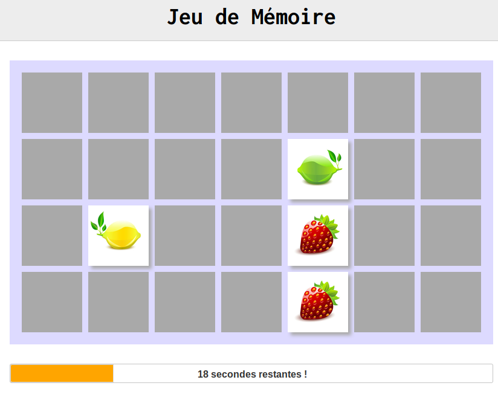

# JavaScript Memory Game

This is a memory game code in javascript with jQuery.

## Rules

* The player must click on two cards. If they are identical, the pair is validated. Otherwise, the cards are turned face down, and the player must select a new pair of cards.

* The player wins if he can discover all the pairs before the end of the allotted time.

Ready to play?

Enjoy, it's free to use and share :) !

## Author

FabCre

I made this little game to practice JavaScript and jQuery.